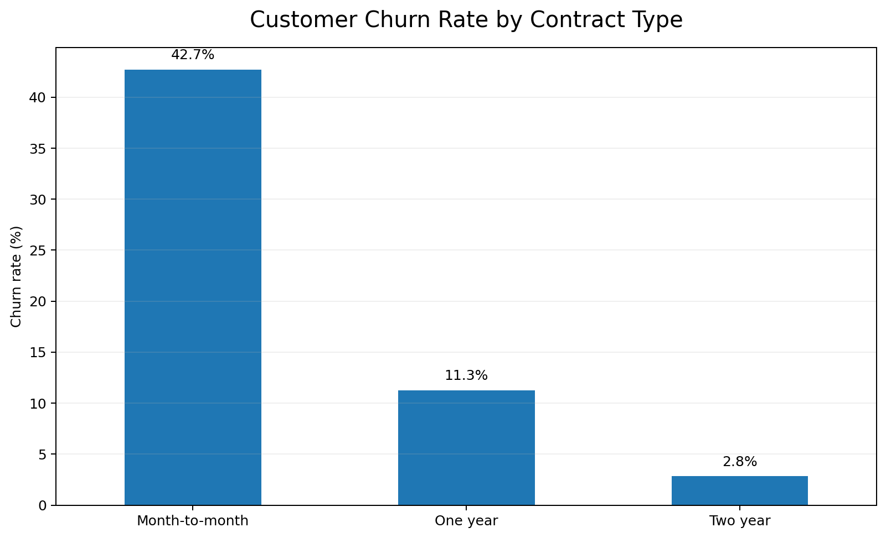
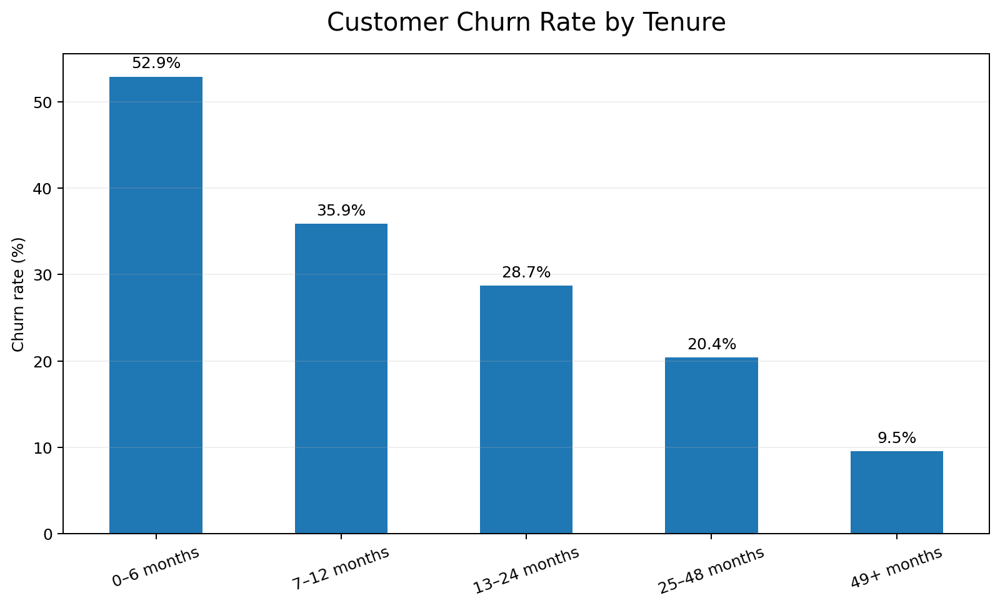
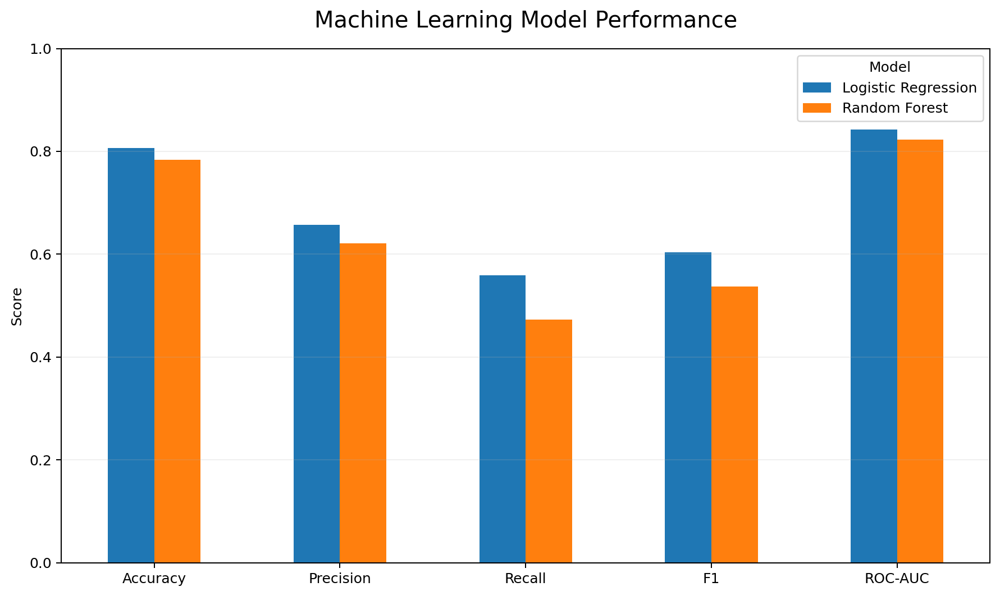
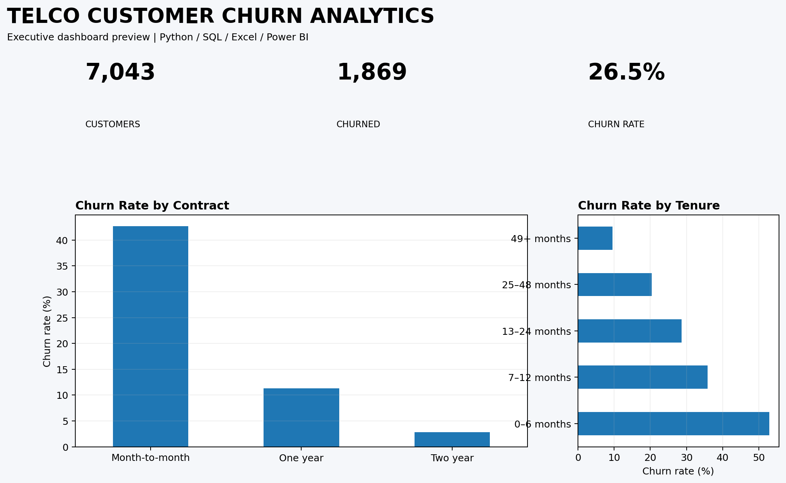
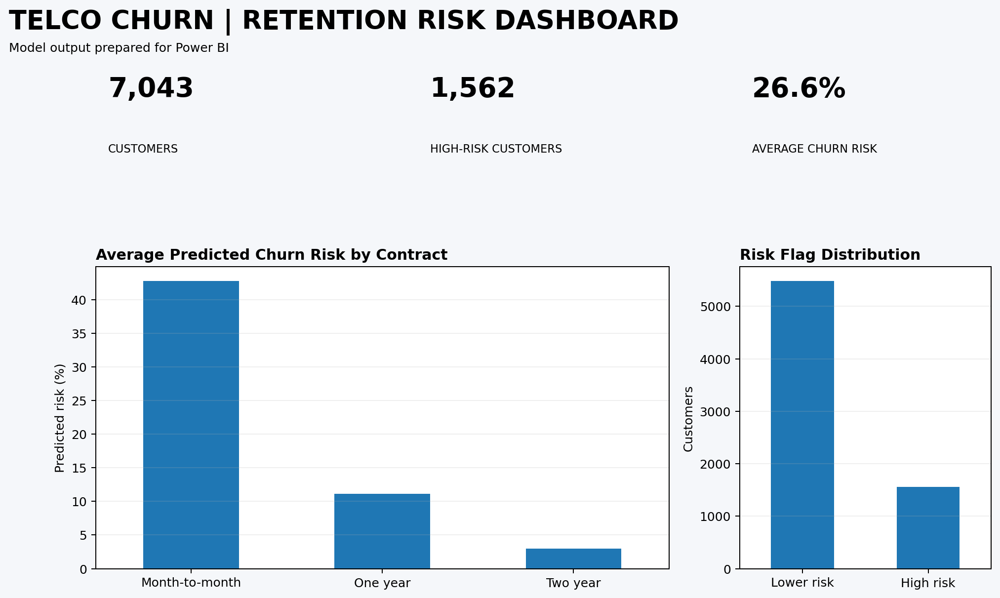

# Telco Customer Churn — Analytics & Machine Learning

An end-to-end portfolio project combining **SQL, Excel, Python/Jupyter and Power BI** to investigate customer churn and build a simple churn-risk model.

## Project goal

A telecom business wants to understand why customers leave and identify active customers who may be at higher risk of churn. The project follows a practical analyst workflow: **raw data → SQL analysis → Python EDA → machine learning → Excel/Power BI reporting**.

## What I built

- Cleaned and profiled **7,043 customer records**.
- Used SQL to answer business questions about churn, contract type, tenure, internet service, payment method and support.
- Used Python/Pandas in Jupyter notebooks for data cleaning and exploratory analysis.
- Built two classification models: **Logistic Regression** and **Random Forest**.
- Evaluated the models using accuracy, precision, recall, F1 and ROC-AUC.
- Generated a customer-level `churn_risk_score` and high-risk flag.
- Prepared an Excel KPI dashboard and a Power BI-ready dataset.

## Main findings

- Overall churn is **26.54%**.
- Month-to-month customers have a **42.71%** churn rate, compared with **11.27%** for one-year contracts and **2.83%** for two-year contracts.
- Among customers with an internet service, the churn rate differs substantially by whether tech support is present.
- Short-tenure customers show higher churn than longer-tenure customers.

These are descriptive relationships in this dataset; they should not be interpreted as proof that a particular service or contract directly causes churn.

## Project structure

```text
Telco-Churn-Analytics/
├── data/
│   ├── telco_churn_raw.csv
│   ├── telco_churn_cleaned.csv
│   └── model_predictions.csv
├── notebooks/
│   ├── 01_Data_Cleaning_and_EDA.ipynb
│   ├── 02_SQL_Business_Analysis.ipynb
│   └── 03_Churn_Machine_Learning.ipynb
├── sql/
│   ├── 01_business_queries.sql
│   ├── churn.db
│   └── query_results.txt
├── excel/
│   └── Churn_Analytics_Dashboard.xlsx
├── powerbi/
│   ├── telco_churn_powerbi_data.csv
│   └── README_PowerBI.md
├── docs/
│   ├── model_metrics.csv
│   └── PROJECT_NOTES.md
├── requirements.txt
├── .gitignore
└── LICENSE
```

## How to run

### 1. Create the environment

```bash
python -m venv .venv

# Windows
.venv\Scripts\activate

# macOS/Linux
source .venv/bin/activate


pip install -r requirements.txt
```

### 2. Open Jupyter

```bash
jupyter notebook
```

Run the notebooks in order:

1. `01_Data_Cleaning_and_EDA.ipynb`
2. `02_SQL_Business_Analysis.ipynb`
3. `03_Churn_Machine_Learning.ipynb`

## Power BI

Import `powerbi/telco_churn_powerbi_data.csv` into Power BI Desktop and follow `powerbi/README_PowerBI.md` to create the dashboard.

## Excel

Open `excel/Churn_Analytics_Dashboard.xlsx`. The workbook contains raw data and a formula-driven KPI dashboard.

## Dataset

The project uses the IBM Telco Customer Churn sample dataset. The raw file is included for reproducibility.

## Skills demonstrated

**SQL:** SELECT, CASE, WHERE, GROUP BY, aggregate functions, ORDER BY, data-quality checks.

**Python:** Pandas, data cleaning, EDA, matplotlib, train/test split, preprocessing pipelines, classification, model evaluation.

**Machine learning:** Logistic Regression, Random Forest, probability scoring, classification metrics.

**Excel:** formulas, KPI reporting, segmentation and dashboard layout.

**Power BI:** data import, DAX measures, KPI cards, segmentation charts and an actionable retention table.


## Dashboard & Analysis Preview

### Churn by contract


### Churn by tenure


### Model performance


### Excel dashboard preview


### Power BI dashboard preview

